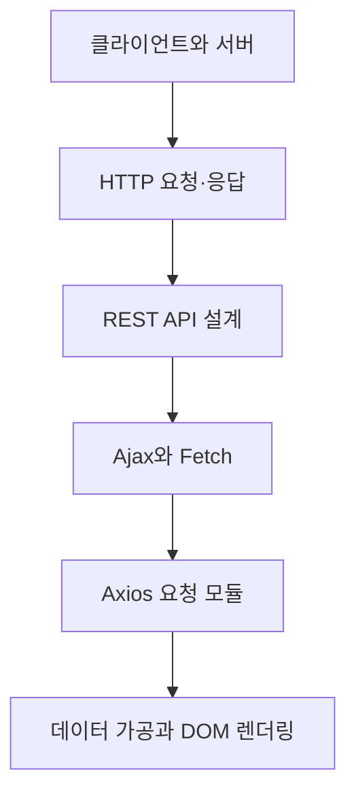

# Ajax와 REST API

> 웹 화면이 서버 데이터와 만나는 지점을 HTTP 메시지부터 안전한 DOM 갱신까지 한 흐름으로 정리합니다.

클라이언트와 서버의 역할을 출발점으로 HTTP 요청·응답 구조, 자원 중심 REST 설계, Fetch와 Axios 요청, API 데이터의 화면 반영까지 학습합니다. 문법을 외우기보다 요청이 어디서 시작하고 어떤 단계에서 실패하며 결과가 어떻게 화면에 도착하는지 추적하는 것이 목표입니다.

## 학습 로드맵

## 목차

| # | 글 | 한 줄 소개 | 활용도 |
|---|---|---|---|
| 1 | [클라이언트·서버와 HTTP 통신](01-client-server-and-http.md) | 웹 통신의 역할과 요청·응답 흐름 | ★★★★★ |
| 2 | [HTTP 요청과 응답 메시지](02-http-messages.md) | 메서드·헤더·본문·상태 코드 읽기 | ★★★★★ |
| 3 | [자원 중심의 REST API 설계](03-rest-api-design.md) | URI와 메서드로 CRUD 표현하기 | ★★★★★ |
| 4 | [Ajax와 Fetch API](04-ajax-xhr-and-fetch.md) | 새로고침 없는 통신과 Fetch 오류 처리 | ★★★★★ |
| 5 | [Axios 요청 패턴](05-axios-request-patterns.md) | 응답 객체 이해와 API 모듈 분리 | ★★★★☆ |
| 6 | [API 데이터와 DOM 렌더링](06-api-data-and-dom-rendering.md) | 입력 검증·배열 가공·화면 갱신 | ★★★★★ |

## 다루는 핵심 개념

- 클라이언트–서버 구조와 HTTP의 무상태
- 요청 메서드, 경로, 헤더, 본문과 응답 상태 코드
- REST의 자원·행위·표현과 일관된 URI 설계
- Ajax, XMLHttpRequest, Fetch API의 관계
- Axios 응답 객체, 구조 분해 할당, API 모듈
- 이벤트 처리, 입력 검증, 배열 검색, DOM 갱신 최소화

## 학습 포인트

- 네트워크 오류와 4xx·5xx HTTP 응답은 같은 실패가 아닙니다.
- Fetch는 응답 상태와 본문 읽기를 나눠 처리합니다.
- Axios의 `data`는 전체 응답 객체가 아니라 서버 본문입니다.
- API 주소는 자원, HTTP 메서드는 행위를 표현하게 설계합니다.
- 받은 데이터는 검증과 가공을 거쳐 DOM에 가능한 한 번에 반영합니다.

## 추천 학습 순서

처음 학습한다면 1번부터 차례대로 읽으세요. 이미 API 호출 경험이 있다면 2번에서 네트워크 메시지 구조를 점검한 뒤 4~6번의 코드 흐름을 연결해 보는 것이 좋습니다. 각 글의 직접 해보기와 복습 질문을 먼저 풀고 답 토글을 여는 방식으로 학습하면 이해 여부를 빠르게 확인할 수 있습니다.

## 함께 보면 좋은 자료

- [용어집](GLOSSARY.md)
