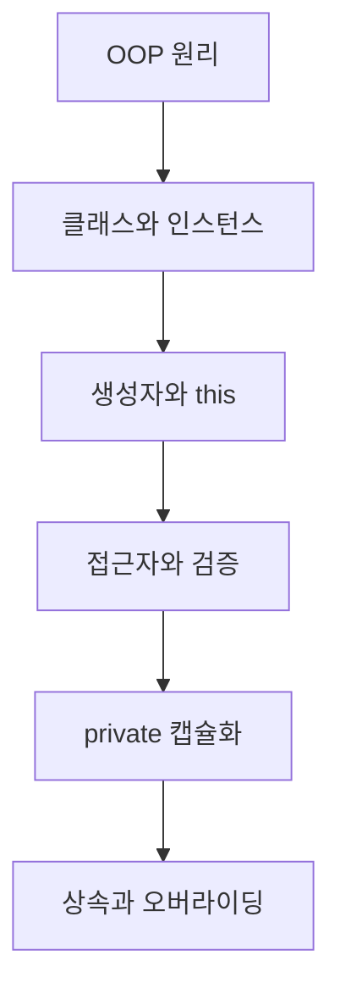

# JavaScript 객체 지향 프로그래밍

> 클래스 문법을 외우는 데서 멈추지 않고, 객체의 상태를 안전하게 설계하고 확장하는 흐름을 익힙니다.

객체 지향의 네 가지 특성을 출발점으로 클래스와 인스턴스, 생성자와 `this`, 접근자, private 필드, 상속과 오버라이딩을 학습합니다. 각 문법이 어떤 설계 문제를 해결하는지 코드 실행 흐름과 함께 연결하는 것이 목표입니다.

## 학습 로드맵

## 목차

| # | 글 | 한 줄 소개 | 활용도 |
|---|---|---|---|
| 1 | [객체 지향 프로그래밍의 핵심 원리](01-oop-principles.md) | 추상화·캡슐화·상속·다형성의 역할 | ★★★★★ |
| 2 | [클래스와 인스턴스](02-classes-and-instances.md) | 공통 정의로 독립적인 객체 만들기 | ★★★★★ |
| 3 | [생성자와 this](03-constructor-and-this.md) | 초기 상태와 현재 인스턴스 연결하기 | ★★★★★ |
| 4 | [접근자와 상태 검증](04-accessors-and-validation.md) | getter·setter로 읽기와 변경 통제 | ★★★★☆ |
| 5 | [private 필드와 캡슐화](05-private-fields-and-encapsulation.md) | 내부 상태와 불변 조건 보호하기 | ★★★★★ |
| 6 | [상속과 super, 오버라이딩](06-inheritance-super-and-overriding.md) | 부모 기능을 재사용하고 차이 확장하기 | ★★★★★ |

## 다루는 핵심 개념

- 객체의 상태와 행동, OOP의 네 가지 특성
- 클래스, 인스턴스, 프로퍼티, 메서드
- 생성자 초기화와 호출 방식에 따른 `this`
- getter, setter, 값 검증, 읽기 전용 인터페이스
- private 필드와 private 메서드를 통한 캡슐화
- `extends`, `super()`, 부모 메서드 호출, 오버라이딩

## 학습 포인트

- 클래스는 객체 지향 그 자체가 아니라 설계를 표현하는 문법입니다.
- 매개변수와 `this.property`는 이름이 같아도 역할이 다릅니다.
- setter 안에서 같은 접근자에 대입하면 무한 재귀가 생길 수 있습니다.
- private 요소는 자식 클래스에서도 직접 접근할 수 없습니다.
- 파생 클래스 생성자에서는 `this`보다 먼저 `super()`를 호출해야 합니다.
- 상속은 관계가 자연스러울 때 사용하고, 기능 조합이 목적이면 조합도 고려합니다.

## 추천 학습 순서

처음이라면 1번부터 순서대로 읽으며 각 예제에서 어느 값이 인스턴스 상태인지 표시해 보세요. 이후 직접 해보기 코드를 실행하고, 마지막에는 동일한 문제를 상속 대신 조합으로 풀 수 있는지도 비교하면 설계 감각을 기를 수 있습니다.

## 함께 보면 좋은 자료

- [용어집](GLOSSARY.md)
