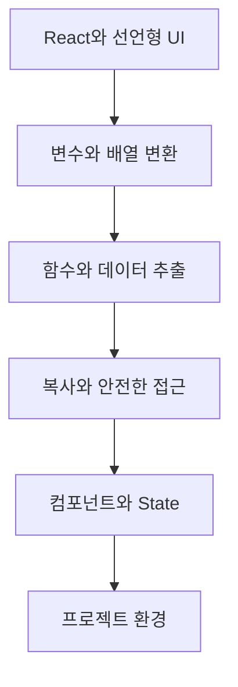

# React 입문과 최신 JavaScript

> React의 선언형 UI 사고를 이해하고, 컴포넌트 작성에 필요한 JavaScript 문법과 프로젝트 환경을 한 흐름으로 연결합니다.

React의 역할과 기존 DOM 조작 방식의 차이부터 시작해 배열 메서드, 화살표 함수, 구조 분해, 전개 구문, 컴포넌트와 State, 개발 환경까지 학습합니다. 문법을 따로 암기하기보다 UI 데이터 흐름에서 왜 필요한지 이해하는 것이 목표입니다.

## 학습 로드맵

## 목차

| # | 글 | 한 줄 소개 | 활용도 |
|---|---|---|---|
| 1 | [React의 역할과 학습 방향](01-react-overview.md) | React·JSX·컴포넌트의 큰 그림 | ★★★★★ |
| 2 | [명령형 DOM과 선언형 UI](02-imperative-vs-declarative-ui.md) | 화면 갱신 사고방식 비교 | ★★★★★ |
| 3 | [변수 선언과 배열 메서드](03-variables-and-array-methods.md) | const·let·forEach·map·filter | ★★★★★ |
| 4 | [화살표 함수와 구조 분해](04-arrow-functions-and-destructuring.md) | 콜백과 컴포넌트 입력 간결화 | ★★★★★ |
| 5 | [전개 구문과 안전한 값 접근](05-spread-template-and-optional-chaining.md) | 복사·문자열·중첩 데이터 처리 | ★★★★★ |
| 6 | [컴포넌트와 State로 목록 설계](06-components-and-state.md) | 상태 기반 Todo 목록 흐름 | ★★★★★ |
| 7 | [React 프로젝트 환경과 구조](07-react-project-setup.md) | Node.js·npm·진입점·의존성 | ★★★★☆ |

## 다루는 핵심 개념

- React, JSX, 컴포넌트와 선언형 렌더링
- `const`, `let`, `forEach`, `map`, `filter`
- 화살표 함수, 구조 분해, 단축 속성명
- 전개 구문, 템플릿 리터럴, 옵셔널 체이닝
- Props, State, 이벤트, 목록 key
- Node.js, npm, package.json과 프로젝트 구조

## 학습 포인트

- React는 JavaScript를 대체하지 않으며 최신 문법 활용도가 높습니다.
- map은 JSX 목록 변환, filter는 상태 배열의 선택과 삭제에 자주 쓰입니다.
- 전개 구문은 얕은 복사이므로 중첩 상태는 변경 경로별로 복사합니다.
- State는 직접 변경하지 않고 setter로 새 값을 전달합니다.
- 목록 key는 배열 위치보다 데이터의 안정적인 식별자를 사용합니다.
- 프로젝트 실행 환경은 의존성 선언과 명령을 통해 다른 PC에서도 재현합니다.

## 추천 학습 순서

1~2번으로 React의 화면 사고방식을 먼저 잡고, 3~5번의 JavaScript 예제를 직접 실행하세요. 그다음 6번의 목록 코드에서 문법이 어떻게 연결되는지 표시하고, 7번으로 프로젝트 파일과 실행 흐름을 정리하면 좋습니다.

## 함께 보면 좋은 자료

- [용어집](GLOSSARY.md)
