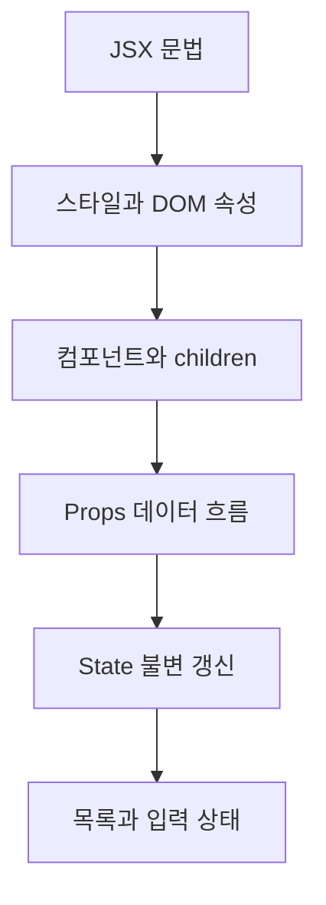

# JSX와 컴포넌트, Props와 State

> JSX로 UI를 표현하고 컴포넌트 사이의 입력과 내부 상태를 구분해 예측 가능한 React 화면을 설계합니다.

JSX 기본 규칙과 DOM 속성부터 함수 컴포넌트, children, Props, State, 불변 갱신, 목록 key와 입력 상태까지 학습합니다. 문법을 따로 외우기보다 데이터가 부모에서 자식으로 흐르고 State 변화가 렌더링으로 이어지는 과정을 연결하는 것이 목표입니다.

## 학습 로드맵

## 목차

| # | 글 | 한 줄 소개 | 활용도 |
|---|---|---|---|
| 1 | [JSX 문법과 기본 규칙](01-jsx-syntax-and-rules.md) | 표현식·태그·Fragment 규칙 | ★★★★★ |
| 2 | [스타일과 React DOM 속성](02-styles-and-dom-attributes.md) | className·style·현재값과 초기값 | ★★★★☆ |
| 3 | [컴포넌트와 children, 렌더링](03-components-children-and-rendering.md) | 함수 컴포넌트의 재사용과 조합 | ★★★★★ |
| 4 | [Props와 단방향 데이터 흐름](04-props-and-data-flow.md) | 읽기 전용 입력과 콜백 전달 | ★★★★★ |
| 5 | [State와 불변 갱신](05-state-and-immutable-updates.md) | useState·함수형 갱신·객체 복사 | ★★★★★ |
| 6 | [목록 key와 입력 상태 설계](06-list-keys-and-form-state.md) | 고유 key와 제어 입력, 배열 갱신 | ★★★★★ |

## 다루는 핵심 개념

- JSX 표현식, 닫는 태그, 단일 최상위 요소와 Fragment
- className, style 객체, React DOM 속성
- 함수 컴포넌트, children, 렌더와 커밋 단계
- Props의 읽기 전용 성질과 단방향 데이터 흐름
- State 스냅샷, setter, 함수형 갱신과 불변성
- 목록 key, 제어 입력, 배열 State 추가·수정·삭제

## 학습 포인트

- JSX 중괄호에는 값을 만드는 표현식을 넣습니다.
- Props는 직접 수정하지 않고 변경 의도는 콜백으로 부모에 전달합니다.
- 이전 State에 의존하는 갱신은 updater 함수를 사용합니다.
- 객체와 배열 State는 기존 참조를 수정하지 않고 새 값을 만듭니다.
- key는 형제 목록에서 안정적이어야 하며 자식 Props로 자동 전달되지 않습니다.
- value와 onChange를 함께 연결하면 React가 입력값을 제어합니다.

## 추천 학습 순서

1~3번으로 JSX와 컴포넌트 구조를 먼저 익힌 뒤 4번에서 데이터 입력 방향을 확인하세요. 5번의 상태 갱신 예제를 직접 실행하고 6번에서 Props, State, 이벤트, map, filter가 하나의 목록 기능으로 연결되는지 추적하면 좋습니다.

## 함께 보면 좋은 자료

- [용어집](GLOSSARY.md)
