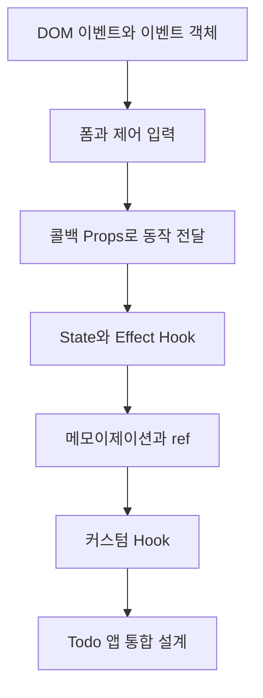

# React 이벤트와 Hooks

> 사용자의 행동을 State 변화로 연결하고, Hook으로 로직을 조직하면 작은 상호작용부터 완성도 있는 애플리케이션까지 같은 원리로 확장할 수 있습니다.

이번 학습에서는 React 이벤트와 폼 처리에서 시작해 컴포넌트 간 콜백, State·Effect, 메모이제이션, ref, 커스텀 Hook을 거쳐 Todo 애플리케이션의 통합 데이터 흐름까지 살펴봅니다.

## 학습 로드맵

## 목차

| # | 글 | 한 줄 소개 | 활용도 |
|---|---|---|---|
| 1 | [React 이벤트와 이벤트 객체](01-react-events-and-event-object.md) | 사용자 행동과 이벤트 정보를 핸들러에 연결합니다. | ★★★★★ |
| 2 | [폼과 제어 입력](02-forms-and-controlled-inputs.md) | 입력값을 State로 관리하고 안전하게 제출합니다. | ★★★★★ |
| 3 | [콜백 Props와 컴포넌트 이벤트](03-callback-props-and-component-events.md) | 자식의 행동을 부모의 State 변경으로 전달합니다. | ★★★★★ |
| 4 | [State Hook과 Effect Hook](04-state-and-effect-hooks.md) | 상태 갱신과 외부 시스템 동기화 원리를 익힙니다. | ★★★★★ |
| 5 | [메모이제이션과 ref](05-memoization-and-refs.md) | 값·함수·DOM 참조를 목적에 맞게 보존합니다. | ★★★★☆ |
| 6 | [커스텀 Hook 설계](06-custom-hooks.md) | 반복되는 상태 로직을 재사용 가능한 인터페이스로 만듭니다. | ★★★★☆ |
| 7 | [통합 Todo 애플리케이션 설계](07-todo-application-architecture.md) | 폼·목록·불변 갱신을 단방향 흐름으로 통합합니다. | ★★★★★ |

## 다루는 핵심 개념

- JSX 이벤트 속성, 함수 참조, 이벤트 객체
- 제어 입력, 폼 제출, 기본 동작 방지
- 콜백 Props와 사용자 정의 컴포넌트 이벤트
- `useState`, 함수형 갱신, `useEffect`, cleanup
- `useMemo`, `useCallback`, `useRef`
- 커스텀 Hook과 독립적인 State
- 목록 key, 불변 갱신, 파생값, 조건부 UI

## 학습 포인트

- 이벤트 속성에 함수 호출 결과가 아니라 함수 자체를 전달하는 이유를 이해합니다.
- 입력값·목록·파생값의 소유 위치를 구분합니다.
- Effect를 모든 계산에 쓰지 않고 외부 시스템 동기화에 사용합니다.
- 메모이제이션 Hook이 각각 무엇을 보존하는지 구분합니다.
- 실제 목록 앱을 작은 컴포넌트와 명확한 콜백 인터페이스로 나눕니다.

## 추천 학습 순서

처음 학습한다면 1번부터 4번까지 순서대로 읽어 이벤트와 State의 기본 흐름을 잡습니다. 이후 5번과 6번으로 최적화와 로직 재사용을 살펴보고, 마지막 7번에서 모든 개념을 하나의 앱 구조로 연결합니다.

## 함께 보면 좋은 자료

- [용어집](GLOSSARY.md)
