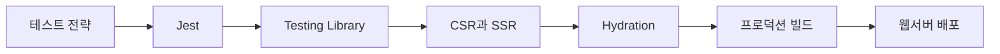

# React 테스팅과 SSR 배포

> 사용자가 믿을 수 있는 동작을 검증하고, 빠르게 보여 주며, 안전하게 인터넷에 공개하는 전 과정을 연결합니다.

이 묶음은 React 코드의 품질을 확인하는 테스트에서 시작해 렌더링 전략과 성능을 이해하고, 프로덕션 빌드와 웹서버 운영으로 이어집니다.

## 학습 로드맵

## 목차

| # | 글 | 한 줄 소개 | 활용도 |
|---|---|---|---|
| 1 | [React 테스트 전략](01-testing-strategy.md) | 테스트 범위와 대역 선택 | ★★★★★ |
| 2 | [Jest 핵심 기능](02-jest-core-features.md) | Matcher, 비동기, Mock과 Snapshot | ★★★★★ |
| 3 | [Testing Library와 사용자 이벤트](03-testing-library-user-events.md) | 사용자 관점의 컴포넌트 테스트 | ★★★★★ |
| 4 | [CSR과 SSR 성능](04-csr-ssr-performance.md) | 렌더링 방식과 성능 지표 비교 | ★★★★★ |
| 5 | [Hydration과 React SSR](05-hydration-and-react-ssr.md) | 서버 HTML을 상호작용 앱으로 연결 | ★★★★★ |
| 6 | [React 프로덕션 빌드](06-react-production-build.md) | 재현 가능한 빌드와 정적 자원 준비 | ★★★★★ |
| 7 | [웹서버와 VM 배포 운영](07-web-server-vm-deployment.md) | 안전한 네트워크·서빙·운영 점검 | ★★★★★ |

## 다루는 핵심 개념

- Unit, Integration, E2E 테스트의 역할
- Jest Matcher, Mock, Lifecycle, Snapshot
- 접근성 중심 DOM 쿼리와 사용자 이벤트
- CSR, SSR, TTFB, FCP, TTI
- 서버 렌더링과 Hydration 일치
- 프로덕션 빌드, 정적 자원, SPA fallback
- VM, 웹서버, 방화벽, SSH와 롤백

## 학습 포인트

- 내부 구현보다 사용자 동작을 테스트합니다.
- 화면 표시 속도와 상호작용 가능 시점을 구분합니다.
- 서버와 클라이언트의 첫 마크업을 일치시킵니다.
- 배포 전에 테스트와 프로덕션 빌드를 같은 절차로 재현합니다.
- 최소 권한, 모니터링과 롤백을 배포의 일부로 봅니다.

## 함께 보면 좋은 자료

- [용어집](GLOSSARY.md)
