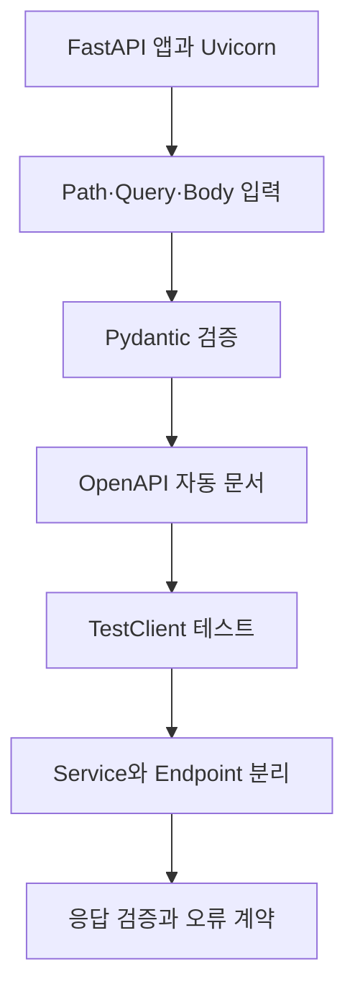

# FastAPI로 백엔드 API 만들기

> 함수 하나를 endpoint로 만드는 것부터 자동 문서, 입력·출력 검증, 반복 가능한 테스트까지 연결합니다.

FastAPI는 Python type hint를 단순한 설명에 그치지 않고 요청 parsing, validation, OpenAPI 문서에 활용합니다. 이 자료는 작은 텍스트 변환 기능을 통해 server 실행부터 오류 계약까지 단계적으로 익히도록 구성했습니다.

## 학습 로드맵



## 목차

| # | 글 | 한 줄 소개 | 활용도 |
|---|---|---|---|
| 1 | [FastAPI 앱 구조와 서버 실행](01-fastapi-app-and-server.md) | 앱, path operation, Uvicorn의 관계 | ★★★★★ |
| 2 | [요청 파라미터와 Pydantic 모델](02-request-parameters-and-pydantic.md) | Path·query·body 입력과 자동 검증 | ★★★★★ |
| 3 | [OpenAPI와 자동 API 문서](03-openapi-and-automatic-docs.md) | 코드에서 schema와 문서가 생성되는 흐름 | ★★★★☆ |
| 4 | [TestClient로 API 검증하기](04-testclient-api-testing.md) | 성공·실패 계약과 Notebook 재현성 | ★★★★★ |
| 5 | [텍스트 처리 Service와 Endpoint](05-text-service-and-endpoint.md) | 처리 로직 분리와 입출력 모델 설계 | ★★★★★ |
| 6 | [응답 검증과 오류 처리](06-response-validation-and-errors.md) | Response model, status, 오류 code | ★★★★★ |

## 다루는 핵심 개념

- FastAPI 앱과 ASGI server의 역할
- Path parameter, query parameter, request body 구분
- Pydantic 기반 parsing과 validation
- OpenAPI schema와 대화형 문서
- TestClient와 pytest assertion
- Service 함수와 endpoint의 책임 분리
- Response validation과 명시적인 오류 계약

## 학습 포인트

- Type hint가 editor 지원뿐 아니라 실행 시 입력 계약으로 사용되는 과정을 이해합니다.
- `/docs`에서 한 번 호출하는 것과 자동화된 contract test의 차이를 구분합니다.
- Notebook의 과거 변수나 누락된 함수 호출이 잘못된 결과 해석을 만들 수 있음을 기억합니다.
- Response field 철자와 타입이 schema와 다르면 server 구현 오류가 된다는 점을 확인합니다.
- 고정된 허용 값은 Enum, 외부 상태가 필요한 규칙은 service 검증으로 나누어 봅니다.

## 전체 요청 흐름

```text
Client request
  → Uvicorn
  → FastAPI router
  → parameter parsing
  → Pydantic validation
  → endpoint
  → service function
  → response model validation/filtering
  → JSON response
```

## 복습 전략

1. 가장 작은 status endpoint를 만들고 server를 실행합니다.
2. Path, query, body 입력을 하나씩 추가합니다.
3. 정상 입력과 잘못된 입력을 TestClient로 비교합니다.
4. OpenAPI `paths`와 `/docs`에서 코드가 반영됐는지 확인합니다.
5. 처리 함수를 endpoint 밖으로 분리해 unit test를 작성합니다.
6. Response model field를 일부러 틀려 보고 test가 어떻게 실패하는지 관찰합니다.

## 함께 보면 좋은 자료

- [용어집](GLOSSARY.md)

## 최종 점검

- [ ] FastAPI app과 Uvicorn의 역할을 구분한다.
- [ ] Path, query, body의 선언 규칙을 설명한다.
- [ ] OpenAPI schema가 만들어지는 근거를 안다.
- [ ] TestClient로 성공과 422 응답을 검증한다.
- [ ] Service와 endpoint를 분리한다.
- [ ] Response validation 실패를 server 오류로 해석한다.
