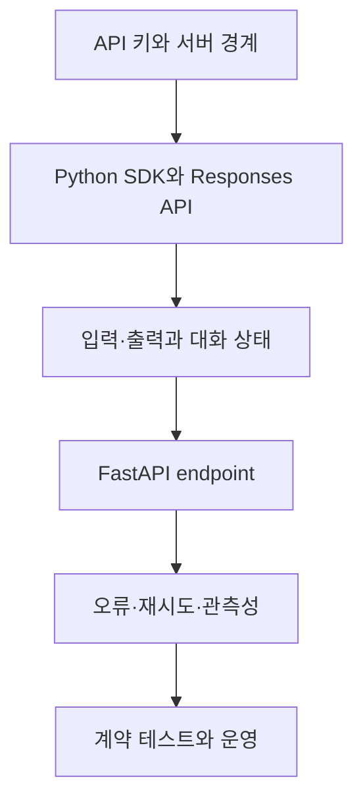

# OpenAI API 연동과 LLM 엔드포인트

> 비밀 관리부터 Python SDK 호출, FastAPI 연동, 대화 상태, 오류 처리와 계약 테스트까지 하나의 운영 가능한 흐름으로 연결합니다.

이 자료는 실습의 핵심 개념을 공개 저장소에 적합한 독립 예제로 재구성했습니다. 실제 자격 증명, 기관 전용 주소, 원본 문제와 답안은 포함하지 않습니다. OpenAI 직접 통합은 현재 공식 문서의 Responses API 흐름을 중심으로 설명하고, 기존 Chat Completions 호환 환경은 차이를 분리해 다룹니다.

## 학습 로드맵



## 목차

| # | 글 | 한 줄 소개 | 활용도 |
|---|---|---|---|
| 1 | [API 키와 서버 보안](01-api-key-and-server-security.md) | 키를 서버에 두고 설정과 노출 대응을 관리 | ★★★★★ |
| 2 | [Python SDK와 Responses API](02-python-sdk-and-responses-api.md) | 현재 OpenAI 호출의 기본 구조 | ★★★★★ |
| 3 | [입력·출력과 대화 상태](03-input-output-and-conversation-state.md) | 멀티턴 맥락과 공개 응답 계약 | ★★★★☆ |
| 4 | [FastAPI와 LLM 연결](04-fastapi-llm-integration.md) | 요청 검증과 service 경계 구성 | ★★★★★ |
| 5 | [오류 처리·재시도·관측성](05-errors-retries-and-observability.md) | 외부 실패를 안전하게 분류·추적 | ★★★★★ |
| 6 | [계약 테스트와 운영 점검](06-contract-testing-and-operations.md) | Mock 기반 회귀 test와 배포 점검 | ★★★★★ |

## 전체 요청 흐름

```text
Authenticated client
  → input validation / rate limit
  → FastAPI /chat
  → LLM service
  → OpenAI Responses API
  → output normalization
  → safe response + structured log
```

## 핵심 설계 원칙

- 키와 모델 정책은 신뢰할 수 있는 서버가 소유합니다.
- 외부 공급자 객체를 공개 API 계약과 분리합니다.
- 입력 길이, timeout, 동시성, 재시도에 상한을 둡니다.
- 사용자 인증 실패와 서버의 공급자 인증 실패를 구분합니다.
- 실제 모델 호출 없이도 대부분의 endpoint 계약을 검증합니다.
- 로그에는 비밀이나 원문 대화를 기본으로 남기지 않습니다.

## 권장 학습 순서

1. 환경 변수 이름만 있는 예시 설정을 만듭니다.
2. Responses API로 단일 요청을 호출합니다.
3. LLM 호출을 `generate_reply()` service로 분리합니다.
4. FastAPI request·response model을 정의합니다.
5. 공백·길이·timeout·rate limit 실패를 설계합니다.
6. Fake service로 성공과 실패 계약을 자동화합니다.

## 함께 보면 좋은 자료

- [용어집](GLOSSARY.md)
- [OpenAI API 개요](https://developers.openai.com/api/reference/overview)
- [Responses 생성 API](https://developers.openai.com/api/reference/resources/responses/methods/create)

## 최종 점검

- [ ] 실제 키와 전용 URL이 코드·문서·로그에 없다.
- [ ] 새 OpenAI 통합에서 Responses API의 기본 흐름을 설명한다.
- [ ] Request와 response schema를 검증한다.
- [ ] 대화 상태의 저장·격리·삭제 정책을 고려한다.
- [ ] 오류 category와 공개 상태 코드를 정의한다.
- [ ] Provider를 mock한 계약 test를 작성한다.
- [ ] Request ID로 장애를 추적할 수 있다.

## 한 줄 정리

> 안전한 LLM endpoint는 모델 호출 한 줄이 아니라 비밀, 계약, 상태, 실패와 운영을 함께 설계한 시스템입니다.
