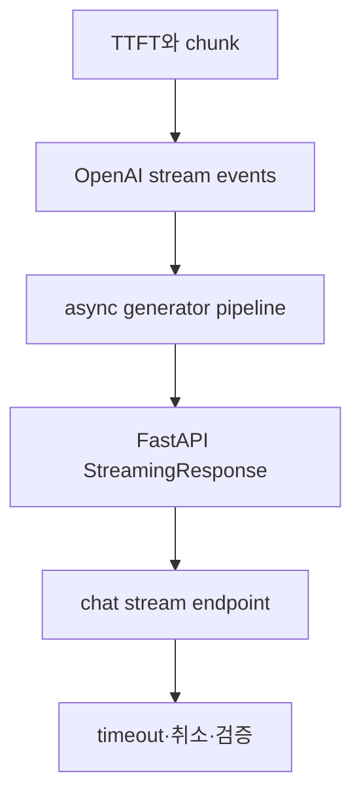

# 스트리밍 응답 API 구현

> OpenAI stream event, async generator, FastAPI StreamingResponse, chat endpoint, 오류·취소 처리를 하나의 전송 흐름으로 연결합니다.

원본 실습의 개념을 공개 저장소에 적합한 독립 예제로 재구성했습니다. 실제 자격증명, 교육 환경 전용 주소, 원본 과제·답안은 포함하지 않습니다. 최신 OpenAI 직접 통합은 Responses API 이벤트 기반 stream을 우선 설명하고, Chat Completions 호환 chunk 방식은 비교 대상으로 다룹니다.

## 학습 로드맵



## 목차

| # | 글 | 한 줄 소개 | 활용도 |
|---|---|---|---|
| 1 | [스트리밍 응답의 원리](01-streaming-fundamentals.md) | TTFT, token, chunk와 적용 판단 | ★★★★★ |
| 2 | [OpenAI 스트림 이벤트 처리](02-openai-stream-events.md) | Responses API event와 호환 chunk 비교 | ★★★★★ |
| 3 | [async generator 파이프라인](03-async-generator-pipelines.md) | await 가능한 조각 변환 흐름 | ★★★★★ |
| 4 | [FastAPI StreamingResponse](04-fastapi-streamingresponse.md) | HTTP stream과 SSE 전달 | ★★★★★ |
| 5 | [chat stream endpoint 설계](05-chat-stream-endpoint.md) | 입력 검증·서버 정책·protocol | ★★★★★ |
| 6 | [스트리밍 오류·취소·결과 점검](06-stream-errors-cancellation-testing.md) | timeout·취소·contract test | ★★★★★ |

## 전체 흐름

```text
Client stream reader
  → FastAPI /chat/stream
  → async generator transform
  → OpenAI response event stream
  → text delta / completed / error
```

## 핵심 설계 원칙

- 첫 텍스트가 보이는 시간과 전체 완료 시간을 따로 측정합니다.
- event type을 기준으로 text·완료·오류를 분기합니다.
- 빈 조각과 provider 내부 객체를 외부 contract에서 분리합니다.
- server와 client가 모두 streaming 방식으로 동작하는지 확인합니다.
- 이미 시작한 stream의 오류 protocol과 cancellation cleanup을 설계합니다.
- 부분 출력은 moderation·개인정보 정책의 별도 검토 대상입니다.

## 함께 보면 좋은 자료

- [용어집](GLOSSARY.md)
- [OpenAI 스트리밍 공식 가이드](https://developers.openai.com/api/docs/guides/streaming-responses)

## 최종 점검

- [ ] 일반 응답과 stream의 차이를 설명한다.
- [ ] `response.output_text.delta` event를 처리한다.
- [ ] async generator를 `async for`로 소비한다.
- [ ] StreamingResponse와 client stream reader를 함께 사용한다.
- [ ] timeout과 cancellation을 구분한다.
- [ ] HTTP 시작 성공과 생성 완료를 구분한다.
- [ ] 실제 키와 환경 전용 URL을 포함하지 않는다.

## 한 줄 정리

> 좋은 스트리밍 API는 빠른 첫 글자뿐 아니라 event 계약, 취소 정리, 오류 검증까지 함께 설계합니다.
