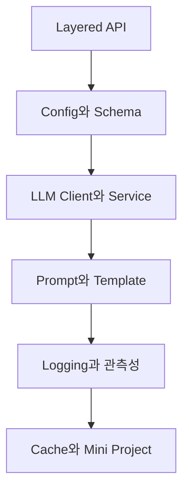

# 실무형 API 구조와 미니 프로젝트

> FastAPI와 LLM 호출을 레이어로 분리하고 프롬프트, 로깅, 캐싱, 테스트를 더해 운영 가능한 작은 프로젝트로 조립합니다.

원본 강의와 실습을 공개 저장소에 적합한 독립 예제로 재구성했습니다. 실제 자격증명, 환경 전용 URL, 원본 과제·정답은 포함하지 않습니다. OpenAI 직접 호출은 최신 Responses API 경계를 기준으로 설명하고, 교육 환경의 Chat Completions 호환 방식은 Client adapter 내부 구현으로 한정합니다.

## 학습 로드맵



## 목차

| # | 글 | 한 줄 소개 | 활용도 |
|---|---|---|---|
| 1 | [실무형 레이어드 API 구조](01-layered-api-architecture.md) | Router·Service·Client 책임과 의존성 | ★★★★★ |
| 2 | [설정과 Schema 설계](02-configuration-and-schemas.md) | 비밀 설정과 입출력 계약 | ★★★★★ |
| 3 | [LLM Client와 Service 모듈화](03-llm-client-service-modularization.md) | SDK 경계와 업무 정책 분리 | ★★★★★ |
| 4 | [System Prompt와 Template](04-system-prompts-and-templates.md) | 행동 정책의 버전·검증·평가 | ★★★★★ |
| 5 | [Logging과 관측성](05-logging-and-observability.md) | Request ID, TTFT, 오류 추적 | ★★★★★ |
| 6 | [응답 캐시와 미니 프로젝트](06-response-cache-and-mini-project.md) | Key·TTL·테스트와 프로젝트 조립 | ★★★★★ |

## 전체 구조

```text
Client request
  → Router: HTTP contract
  → Service: prompt, cache, policy
  → Client adapter: OpenAI Responses API
  → normalized result
  → response + structured log
```

## 핵심 설계 원칙

- 변경 이유가 다른 코드를 같은 함수에 섞지 않습니다.
- API key와 환경별 설정은 코드·저장소에서 분리합니다.
- Provider SDK 객체를 공개 API까지 노출하지 않습니다.
- 프롬프트는 version과 평가 결과를 추적합니다.
- 로그는 비밀을 제외하고 요청 흐름을 재구성할 field를 남깁니다.
- Response cache와 prompt caching을 구분합니다.
- 실제 API 호출 전 Fake Client로 대부분의 계약을 검증합니다.

## 함께 보면 좋은 자료

- [용어집](GLOSSARY.md)
- [OpenAI Responses API](https://developers.openai.com/api/reference/cli/resources/responses/methods/create)
- [OpenAI Prompt Caching](https://developers.openai.com/api/docs/guides/prompt-caching)

## 최종 점검

- [ ] Router·Service·Client의 책임이 구분되어 있다.
- [ ] 의존성이 위에서 아래로 흐른다.
- [ ] 실제 key와 환경 전용 URL이 없다.
- [ ] Prompt version과 request ID를 추적한다.
- [ ] Cache key에 결과 영향 요소가 포함된다.
- [ ] TTL과 사용자 격리 정책이 있다.
- [ ] Fake Client로 성공·오류·cache를 테스트한다.

## 한 줄 정리

> 실무형 API는 기능을 늘리기 전에 변경·보안·관측·테스트 경계를 먼저 세운 작은 시스템입니다.
