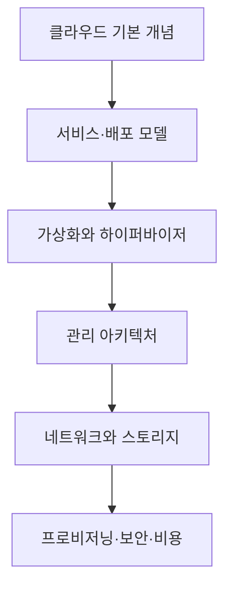

# 클라우드 컴퓨팅 기초

> 클라우드를 서비스 이름으로 외우지 않고 자원 추상화, 책임 분담, 가상화, 네트워크, 스토리지, 운영의 연결 구조로 이해합니다.

이 학습노트는 클라우드의 기본 개념부터 실제 VM이 만들어지고 관리되는 흐름까지 이어집니다. 특정 공급자의 화면이나 오래된 시장 수치보다 여러 환경에 공통으로 적용되는 판단 기준에 집중합니다.

## 학습 로드맵



## 목차

| # | 글 | 한 줄 소개 | 활용도 |
|---|---|---|---|
| 1 | [클라우드 컴퓨팅의 기본 개념](01-cloud-computing-fundamentals.md) | 온디맨드 자원과 장점·위험 이해 | ★★★★★ |
| 2 | [서비스 모델과 배포 모델](02-service-and-deployment-models.md) | 관리 책임과 배치 전략 구분 | ★★★★★ |
| 3 | [가상화와 하이퍼바이저](03-virtualization-and-hypervisors.md) | 물리 자원을 VM으로 나누는 원리 | ★★★★★ |
| 4 | [클라우드 관리 아키텍처](04-cloud-management-architecture.md) | 자원·이미지·권한 생명주기 | ★★★★★ |
| 5 | [클라우드 네트워크와 스토리지](05-cloud-network-and-storage.md) | 통신 경계와 데이터 접근 방식 | ★★★★★ |
| 6 | [프로비저닝·보안·비용 운영](06-provisioning-security-and-cost.md) | 생성부터 관찰·회수까지의 운영 | ★★★★★ |

## 전체 구조

```text
User / API request
        ↓
Identity & policy
        ↓
Cloud management layer
        ↓
Compute + Network + Storage + Image
        ↓
Monitoring + Security + Cost control
```

## 다루는 핵심 개념

- 온디맨드 자원 제공과 탄력성
- SaaS·PaaS·IaaS의 공동 책임
- Public·Private·Hybrid·Multi Cloud
- VM과 Type 1·Type 2 하이퍼바이저
- Cloud Manager, 이미지, IAM
- 서브넷·라우팅·오브젝트·블록·파일 스토리지
- 프로비저닝, 모니터링, 보안, 비용 거버넌스

## 학습 포인트

- 서비스 모델과 배포 모델을 같은 분류로 섞지 않습니다.
- 클라우드도 결국 물리 자원을 가상화해 제공한다는 점을 기억합니다.
- VM 생성 화면의 각 선택이 운영·보안·비용 결정임을 이해합니다.
- 데이터 형태만이 아니라 접근 패턴으로 저장 방식을 선택합니다.
- 오래된 시장 통계는 역사적 맥락으로만 보고 현재 의사결정 근거와 구분합니다.

## 함께 보면 좋은 자료

- [용어집](GLOSSARY.md)

## 최종 점검

- [ ] 클라우드의 정의와 장단점을 함께 설명할 수 있다.
- [ ] SaaS·PaaS·IaaS의 책임 범위를 구분한다.
- [ ] Public·Private·Hybrid·Multi Cloud를 구분한다.
- [ ] VM과 하이퍼바이저의 관계를 설명한다.
- [ ] Cloud Manager의 자원 조정 흐름을 이해한다.
- [ ] 오브젝트·블록·파일 스토리지를 상황에 맞게 고른다.
- [ ] 보안과 비용을 자원 생명주기 전체에서 관리한다.

## 한 줄 정리

> 클라우드는 가상화된 자원을 빠르게 빌리는 기술인 동시에 권한·네트워크·데이터·비용을 지속 운영하는 시스템입니다.
