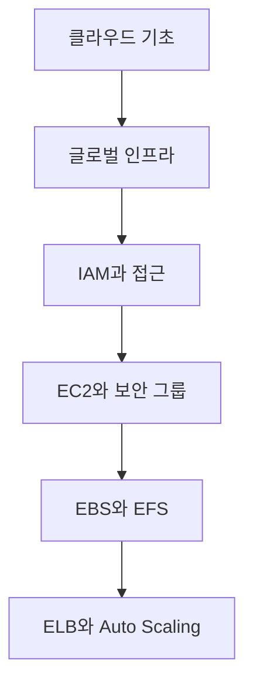

# AWS 입문과 EC2 활용

> AWS의 위치·권한·컴퓨팅·저장소·고가용성 요소를 하나의 웹 서비스 운영 흐름으로 연결합니다.

이번 학습은 클라우드의 책임 모델에서 시작해 Region과 AZ를 선택하고, IAM으로 권한을 제한한 뒤 EC2를 안전하게 운영하는 흐름을 다룹니다. 마지막에는 영구 저장소와 자동 확장 구조를 연결합니다.

## 학습 로드맵



## 목차

| # | 글 | 한 줄 소개 | 활용도 |
|---|---|---|---|
| 1 | [AWS 클라우드 기초와 웹 아키텍처](01-aws-cloud-foundations.md) | 서비스 모델과 웹 계층의 책임을 이해합니다. | ★★★★★ |
| 2 | [AWS 글로벌 인프라](02-aws-global-infrastructure.md) | Region·AZ·Edge의 역할을 구분합니다. | ★★★★★ |
| 3 | [IAM과 AWS 접근 방식](03-iam-and-access-methods.md) | 최소 권한과 안전한 API 접근을 설계합니다. | ★★★★★ |
| 4 | [EC2와 보안 그룹](04-ec2-and-security-groups.md) | 가상 머신과 계층별 네트워크 접근을 구성합니다. | ★★★★★ |
| 5 | [EBS와 EFS 스토리지](05-ebs-and-efs-storage.md) | 블록·파일 저장소의 선택 기준을 익힙니다. | ★★★★☆ |
| 6 | [로드 밸런싱과 오토 스케일링](06-load-balancing-and-auto-scaling.md) | 다중 AZ 고가용성과 탄력성을 연결합니다. | ★★★★★ |

## 다루는 핵심 개념

- 서비스 모델과 공동 책임
- Region, Availability Zone, Edge Location
- IAM Policy, Role, 최소 권한과 MFA
- EC2, AMI, 인스턴스 유형과 보안 그룹
- EBS, EFS, IOPS, 처리량과 스냅샷
- ALB, NLB, Target Group과 Auto Scaling 정책

## 학습 포인트

- 기능 이름보다 각 서비스가 맡는 책임과 장애 범위를 연결합니다.
- 네트워크 접근과 API 권한을 서로 다른 통제 계층으로 구분합니다.
- 고가용성은 다중 배치, 상태 확인, 트래픽 분산, 자동 교체의 조합으로 이해합니다.
- 성능과 보안뿐 아니라 비용·복구·운영 자동화를 함께 판단합니다.

## 전체 구조 한눈에 보기

```text
User
  ↓
Edge / DNS
  ↓
Load Balancer ── health check
  ↓
EC2 instances across AZs ── Auto Scaling
  ↓
EBS or EFS

IAM controls API actions; Security Groups control network paths.
```

## 함께 보면 좋은 자료

- [용어집](GLOSSARY.md)
