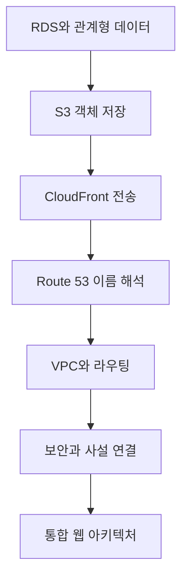

# AWS 스토리지와 네트워킹

> 데이터를 안전하게 저장하고 사용자를 올바른 경로로 연결하는 AWS 서비스들을 하나의 웹 아키텍처로 묶어 봅니다.

이번 학습은 관리형 데이터베이스와 오브젝트 스토리지에서 시작해 CDN·DNS·VPC로 요청 경로를 확장합니다. 마지막에는 고가용성·보안·비용을 함께 고려한 웹 서비스 구조로 연결합니다.

## 학습 로드맵



## 목차

| # | 글 | 한 줄 소개 | 활용도 |
|---|---|---|---|
| 1 | [Amazon RDS와 관리형 데이터베이스](01-rds-managed-databases.md) | 복제·장애 조치·백업의 목적을 구분합니다. | ★★★★★ |
| 2 | [S3 오브젝트 스토리지](02-s3-object-storage.md) | 객체 저장과 수명주기 기준을 익힙니다. | ★★★★★ |
| 3 | [CloudFront와 CDN](03-cloudfront-cdn.md) | 엣지 캐시와 Origin 흐름을 이해합니다. | ★★★★☆ |
| 4 | [Route 53과 DNS 라우팅](04-route53-and-dns.md) | 레코드·TTL·정책으로 이름을 연결합니다. | ★★★★★ |
| 5 | [VPC, 서브넷과 라우팅](05-vpc-subnets-and-routing.md) | 공개·비공개 경로를 계층별로 설계합니다. | ★★★★★ |
| 6 | [VPC 보안과 프라이빗 연결](06-vpc-security-and-private-connectivity.md) | 방화벽 계층과 사설 연결을 구분합니다. | ★★★★★ |
| 7 | [AWS 서비스로 탄탄한 웹 아키텍처 만들기](07-resilient-web-architecture.md) | 전체 서비스를 운영 목표로 결합합니다. | ★★★★★ |

## 다루는 핵심 개념

- RDS, Read Replica, Multi-AZ, 백업과 Aurora
- S3 객체·버킷·저장 등급·수명주기
- CloudFront, Origin, 캐시 키와 TTL
- Route 53 호스팅 영역, 레코드와 라우팅 정책
- VPC, Subnet, Route Table, Internet Gateway와 NAT
- Security Group, NACL, Endpoint와 Peering
- 다중 AZ 웹 아키텍처와 관찰 가능성

## 학습 포인트

- 성능 확장, 고가용성, 백업을 같은 기능으로 혼동하지 않습니다.
- DNS·네트워크 라우팅·애플리케이션 라우팅의 책임을 구분합니다.
- 인터넷 노출은 진입점에 집중하고 내부 계층은 사설 경로와 최소 권한으로 연결합니다.
- 구조도를 외우기보다 장애가 났을 때 각 서비스가 어떤 책임을 지는지 설명합니다.

## 전체 구조 한눈에 보기

```text
User → Route 53 → CloudFront
                    ├─ static → S3
                    └─ dynamic → Load Balancer → private application → RDS

VPC routes define paths; Security Groups and NACLs restrict traffic.
```

## 함께 보면 좋은 자료

- [용어집](GLOSSARY.md)
