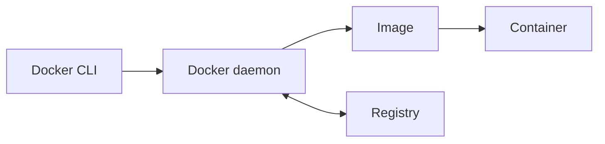

# Docker의 구성 요소와 동작 흐름

> Docker는 명령을 입력하는 도구 하나가 아니라, 이미지를 만들고 보관하고 실행하는 구성 요소들의 협업 구조다.

`Docker CLI` · `daemon` · `image` · `container` · `registry`

## 핵심요약

- 클라이언트는 명령을 전달하고, Docker daemon은 실제 이미지·컨테이너 작업을 수행한다.
- 이미지는 실행 설계도이며 컨테이너는 그 설계도를 실행한 인스턴스다.
- 레지스트리는 이미지를 공유·배포하는 저장소다.

## 1. 클라이언트에서 데몬까지

터미널에서 `docker build`, `docker pull`, `docker run`을 입력하면 CLI가 Docker daemon에 요청을 전달한다. daemon은 이미지, 컨테이너, 네트워크, 볼륨처럼 실제 실행에 필요한 객체를 관리한다.



## 2. Image와 Container

이미지는 파일 시스템과 실행 명령을 기록한 읽기 중심의 템플릿이다. 같은 이미지에서 여러 컨테이너를 만들 수 있으며, 각 컨테이너에는 실행 중 생기는 쓰기 상태가 별도로 생긴다.

| 개념 | 비유 | 실무에서 확인할 것 |
| --- | --- | --- |
| Image | 레시피 | 태그, 베이스 이미지, 취약점 |
| Container | 레시피로 만든 한 접시 | 상태, 로그, 포트, 자원 사용량 |
| Registry | 레시피 저장소 | 출처, 권한, 배포 버전 |

## 3. Registry와 태그

레지스트리에는 이미지가 이름과 태그로 저장된다. 태그는 배포 대상을 구분하는 표지이므로 `latest` 하나에만 의존하기보다 의미 있는 버전 또는 빌드 식별자를 사용하는 편이 추적에 유리하다.

```bash
# 명시적인 태그로 빌드하고 레지스트리로 보낸다.
docker build -t team/sample-api:1.0.0 .
docker push team/sample-api:1.0.0
```

## 직접 해보기

1. `docker run` 요청을 실제로 처리하는 구성 요소를 적어 보세요.
2. 하나의 이미지로 여러 컨테이너를 만들 수 있는지 답해 보세요.
3. 배포 시 태그를 구체적으로 관리해야 하는 이유를 적어 보세요.

<details>
<summary>정답 보기</summary>

1. Docker daemon이 작업을 수행한다.
2. 가능하다. 이미지는 템플릿이고 컨테이너는 그 실행 인스턴스다.
3. 어떤 코드와 의존성 조합이 배포됐는지 추적하고 재현하기 위해서다.

</details>

## 헷갈리기 쉬운 포인트

| 비교 | 핵심 차이 |
| --- | --- |
| image vs container | 실행 설계도 vs 실제로 실행 중인 인스턴스 |
| registry vs local image cache | 공유 저장소 vs 현재 호스트에 내려받은 이미지 |

## 연결되는 개념

- 이전 글: [컨테이너와 격리](01-containers-and-isolation.md)
- 다음 글: [Docker 명령 흐름](03-docker-cli-workflow.md)

## 셀프 체크

- [ ] CLI와 daemon의 역할을 구분할 수 있다.
- [ ] image와 container의 관계를 설명할 수 있다.
- [ ] 태그가 배포 추적에 왜 중요한지 안다.

### 복습 질문 및 답변

**Q1. 컨테이너가 종료되면 이미지도 사라지나요?**

<details>
<summary>답</summary>

아니다. 컨테이너와 이미지는 별도 객체다. 컨테이너를 지워도 이미지가 남아 있을 수 있다.

</details>

**Q2. Docker CLI가 직접 컨테이너를 만드는가요?**

<details>
<summary>답</summary>

CLI는 요청을 전달하는 인터페이스이고, 실제 생성·관리는 daemon이 맡는다.

</details>

**Q3. 태그를 변경하면 이미지 내용도 자동으로 바뀌나요?**

<details>
<summary>답</summary>

태그는 이미지를 가리키는 이름이다. 새 이미지를 빌드하거나 푸시할 때 어떤 태그를 연결할지 명시적으로 관리해야 한다.

</details>

## 한 줄 정리

> Docker는 CLI의 요청을 daemon이 처리하고, 이미지·컨테이너·레지스트리가 배포 흐름을 완성하는 구조다.
