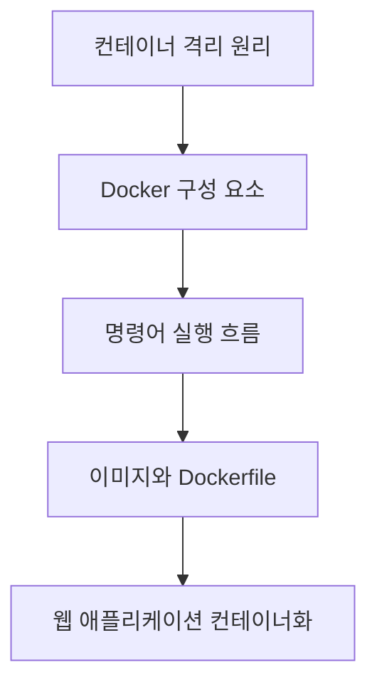

# Docker 기초와 애플리케이션 컨테이너화

> 컨테이너는 코드를 실행 환경과 함께 다루게 해 개발과 배포 사이의 차이를 줄여 준다.

Docker의 격리 원리부터 이미지 작성, 명령어 흐름, FastAPI 애플리케이션 컨테이너화까지를 하나의 배포 흐름으로 정리합니다.

## 학습 로드맵

## 목차

| # | 글 | 한 줄 소개 | 활용도 |
| --- | --- | --- | --- |
| 1 | [컨테이너와 실행 환경 격리](01-containers-and-isolation.md) | VM과 컨테이너, 격리의 기반을 이해한다. | ★★★★★ |
| 2 | [Docker의 구성 요소와 동작 흐름](02-docker-architecture.md) | CLI, daemon, image, registry의 관계를 정리한다. | ★★★★★ |
| 3 | [Docker 기본 명령으로 만드는 실행 흐름](03-docker-cli-workflow.md) | build부터 실행·진단·정리까지 익힌다. | ★★★★★ |
| 4 | [이미지와 레지스트리로 배포 준비하기](04-images-and-registries.md) | 태그와 이미지 출처를 관리한다. | ★★★★☆ |
| 5 | [Dockerfile로 이미지의 실행 규칙 정의하기](05-dockerfile-instructions.md) | 주요 지시어와 캐시 전략을 이해한다. | ★★★★★ |
| 6 | [커스텀 이미지를 빌드하고 실행하기](06-build-and-run-custom-images.md) | 포트와 로그 중심의 진단 흐름을 연습한다. | ★★★★☆ |
| 7 | [FastAPI 애플리케이션 컨테이너화](07-containerizing-fastapi.md) | Python 웹 앱을 재현 가능한 배포 단위로 만든다. | ★★★★★ |

## 학습 포인트

- 컨테이너는 독립 서버가 아니라 커널 기능을 이용해 격리된 실행 환경을 만드는 방식이다.
- 이미지와 컨테이너, 빌드와 실행, EXPOSE와 포트 매핑을 분명히 구분한다.
- Dockerfile은 실행 규칙을 코드처럼 관리하는 문서다. 순서와 비밀값 처리도 배포 품질에 영향을 준다.
- 정상 실행 여부는 컨테이너 상태만이 아니라 로그와 실제 서비스 응답까지 확인한다.

## 함께 보면 좋은 자료

- [용어집](GLOSSARY.md)
