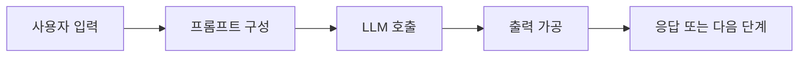

# LangChain의 역할과 기본 흐름

> LangChain은 LLM을 단독 호출하는 데서 끝내지 않고, 프롬프트·모델·외부 도구를 애플리케이션 흐름으로 조합한다.

`LLM` · `프롬프트` · `체인` · `도구 연동` · `모듈화`

## 핵심요약

- LangChain은 LLM 기반 애플리케이션을 구성하는 오픈소스 프레임워크다.
- 입력 가공, 모델 호출, 출력 가공을 모듈로 나눠 재사용한다.
- 최신 정보나 문서 근거가 필요하면 외부 데이터·도구·검색을 연결한다.

## 1. 왜 프레임워크가 필요한가

LLM 호출만으로는 프롬프트 형식, 대화 상태, 외부 데이터, 결과 형식을 일관되게 다루기 어렵다. LangChain은 이 작업을 작은 구성 요소로 분리해 필요한 흐름만 조립하게 한다.

## 직접 해보기

1. LLM 단독 호출이 최신 정보 질문에 약한 이유를 적어 보세요.
2. 프롬프트를 템플릿으로 관리하는 장점을 적어 보세요.
3. 계산이나 검색이 필요한 요청에 추가할 수 있는 요소를 답해 보세요.

정답 보기

1. 모델의 사전 학습 지식만으로는 최신 외부 사실을 보장하기 어렵다.
2. 입력 형식의 재사용성과 일관성이 높아진다.
3. API·검색·계산 같은 Tool을 연결할 수 있다.

## 헷갈리기 쉬운 포인트

| 비교 | 차이 |
| --- | --- |
| LangChain vs LLM | 애플리케이션 구성 프레임워크 vs 텍스트를 생성하는 모델 |
| 프롬프트 vs 응답 | 모델에 주는 지시·문맥 vs 모델이 생성한 결과 |

## 연결되는 개념

- 다음 글: [핵심 구성 요소](02-langchain-components.md)
- 함께 볼 키워드: `RAG`, `Agent`, `관측성`

### 복습 질문 및 답변

**Q1. LangChain이 모델 품질을 자동으로 높이나요?**

답

아니다. 모델의 한계를 없애지는 않지만, 입력·도구·출력·검증 흐름을 더 체계적으로 설계하게 돕는다.

**Q2. 모듈화가 주는 이점은 무엇인가요?**

답

모델이나 파서를 교체해도 전체 앱을 다시 만들지 않고 일부 단계를 바꿀 수 있다.

**Q3. 외부 데이터 연결만으로 답변이 사실이 되나요?**

답

아니다. 검색 품질, 인용 근거, 결과 검증을 함께 설계해야 한다.

