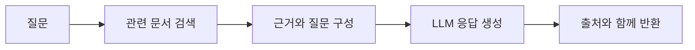

# RAG와 LangChain 활용 사례

> RAG는 모델이 모든 답을 기억하게 만드는 대신, 필요한 근거를 먼저 찾고 그 범위에서 답하도록 만드는 패턴이다.

`RAG` · `문서 검색` · `벡터 저장소` · `Retriever` · `근거 기반 응답`

## 핵심요약

- RAG는 질문과 관련된 문서를 검색한 뒤 그 내용을 LLM 입력에 포함한다.
- 문서 기반 질의응답, FAQ, 요약, 검색형 에이전트와 업무 자동화에 활용할 수 있다.
- 검색 결과의 품질과 근거 제시는 모델 자체만큼 중요하다.

## 1. 검색 증강 생성의 흐름

문서를 작은 단위로 나누고 임베딩해 검색 가능한 형태로 저장한 뒤, Retriever가 질문과 가까운 조각을 찾는다. LLM은 검색 결과를 근거로 답을 구성한다.

## 2. 활용 판단

| 활용 | 적합한 경우 | 주의할 점 |
| --- | --- | --- |
| FAQ 챗봇 | 반복 질문에 빠르게 답할 때 | 최신 정책 반영 |
| 문서 QA | 내부 문서를 근거로 답할 때 | 출처·권한 관리 |
| 요약 | 긴 텍스트의 핵심을 정리할 때 | 누락·왜곡 확인 |
| 검색형 Agent | 실시간 정보가 필요한 때 | Tool 결과 검증 |

## 직접 해보기

1. RAG에서 모델 호출 전에 수행하는 핵심 단계를 적어 보세요.
2. 검색 결과가 질문과 무관하면 답변 품질에 어떤 영향이 있는지 설명해 보세요.
3. 문서 QA에서 출처를 함께 보여 주는 이유를 적어 보세요.

정답 보기

1. 질문과 관련된 문서 조각을 검색한다.
2. 모델이 부적절한 근거를 바탕으로 답하거나 확신에 찬 오답을 낼 수 있다.
3. 사용자가 답의 근거를 검토하고 최신성·적합성을 판단할 수 있다.

## 헷갈리기 쉬운 포인트

| 비교 | 차이 |
| --- | --- |
| RAG vs 모델 재학습 | 실행 시 검색 근거 주입 vs 모델 파라미터 자체 변경 |
| Retriever vs LLM | 관련 문서 후보 검색 vs 문장을 해석·생성 |

## 연결되는 개념

- 이전 글: [Agent와 상태 관리](03-agents-tools-and-memory.md)
- 다음 글: [운영 검증과 한계](05-observability-and-limitations.md)

### 복습 질문 및 답변

**Q1. RAG는 환각을 완전히 없애나요?**

답

아니다. 관련성이 낮은 근거나 모델의 잘못된 해석은 남을 수 있으므로 검색 품질과 근거 검증이 필요하다.

**Q2. 모든 문서를 프롬프트에 넣으면 되나요?**

답

컨텍스트 길이와 비용이 커지고 중요한 근거가 묻힐 수 있다. 질문과 관련된 부분을 검색해 넣는 것이 핵심이다.

**Q3. RAG에 권한 검사가 필요한가요?**

답

필요하다. 검색 단계에서 사용자 권한에 맞는 문서만 후보가 되도록 설계해야 한다.

