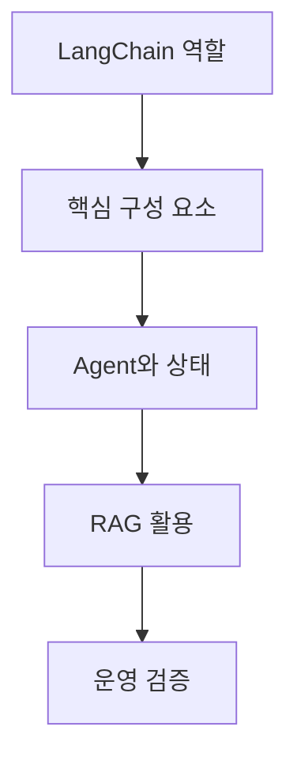

# LangChain으로 만드는 LLM 애플리케이션 흐름

> LangChain은 모델 한 번 호출하기를 넘어, 근거·도구·상태·검증을 연결하는 애플리케이션 설계 도구다.

## 학습 로드맵

## 목차

| # | 글 | 한 줄 소개 |
| --- | --- | --- |
| 1 | [LangChain의 역할과 기본 흐름](01-langchain-foundations.md) | LLM 앱을 모듈로 구성하는 이유를 이해한다. |
| 2 | [LangChain 핵심 구성 요소](02-langchain-components.md) | 템플릿·모델·체인·파서를 연결한다. |
| 3 | [Agent, Tool, Memory](03-agents-tools-and-memory.md) | 도구 사용과 상태 관리의 경계를 설계한다. |
| 4 | [RAG와 활용 사례](04-rag-and-use-cases.md) | 문서 검색 근거를 응답에 연결한다. |
| 5 | [운영 검증과 한계 관리](05-observability-and-limitations.md) | 추적·평가·토큰·버전 변화를 관리한다. |

## 학습 포인트

- 프롬프트·모델·출력 형식의 계약을 분명히 한다.
- 도구 호출과 문서 검색에는 권한·근거·오류 처리가 필요하다.
- LLM 응답은 자연스러움과 별개로 검증·관측·평가가 필요하다.

## 함께 보면 좋은 자료

- [용어집](GLOSSARY.md)
